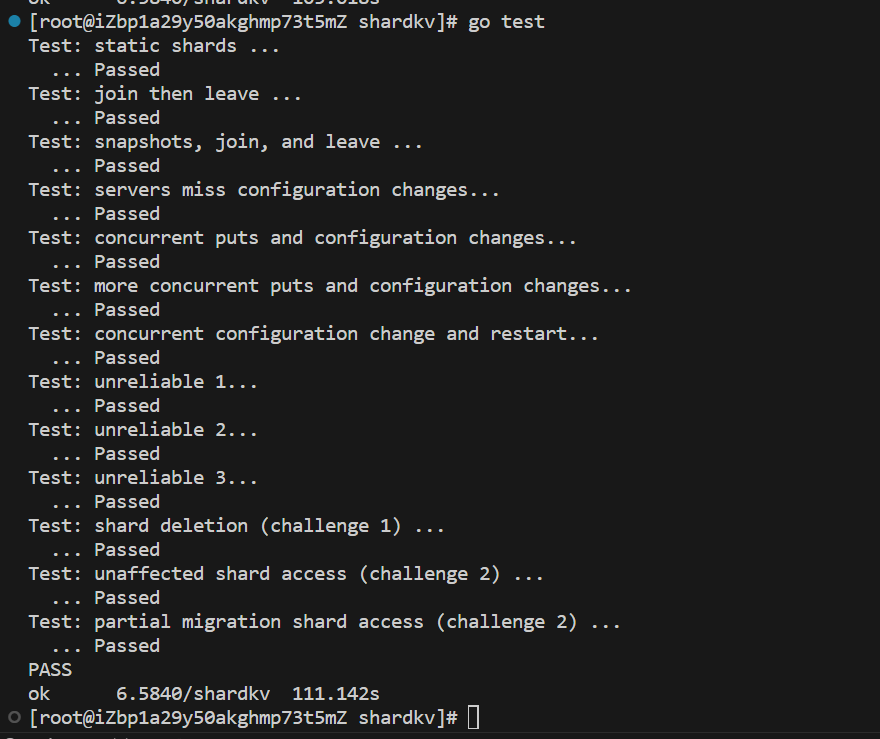

**声明：应课程要求，本仓库应该设置成Private，但是为面试官审查代码方便，仅为面试开放，仓库链接并未广泛传播。求职结束将设置为私有。**

# 更新以下lab4b的代码 -- 2023.12.14
lab4b的代码是写完了，但是卡在了TestSnapshot测试上，组群重启后，shards数组的state成员都是Invalid状态（难道persister没有保存shards数组？？？），最大的槽点是太难调试了！！！只能看日志，简直是地狱级难度！！！，还是gdb香啊。以后有时间再调吧，感觉一两天很难肝完，最近真要被这个实验整崩溃了。

# 更新lab4b代码 -- 2023.12.15
搞定了昨天的bug跑通TestSnapshot。后续测试还是存在bug，待修复。

# 更新lab4b代码(1 -- 2023.12.16
修复昨天的死锁bug，只将应用成功（res == OK）的PutAppend操作记录到去重集中，否则client会**重复使用同一个seq号**向server发请求，server因为将上一次记录“应用失败”的结果不断返回同一个失败。从而导致死锁

# 更新lab4b代码(2 -- 2023.12.16
报错如下：
```bash
--- FAIL: TestConcurrent2 (14.00s)
    test_test.go:22: Get(6): expected:
        3qxHaoDd0H-K4xpoEbS62xyROfMNKjcHGPY32PWCbSXG08jBMxfp7Tj5Zzg_vBAuCEaqIv7me1VLIm0qCL0K3Tm7MdzWqt8Nl0OxEKc7EGT5nBhDJ5DAMg79d
        received:
        3qxHaoDd0H-K4xpoEbS62xyROfMNKjcHGPY32PWCbSXG08jBMxfp7Tj5Zzg_vBAuCEaqIv7me1VLIm0qCL0K3TTm7MdzWqt8Nl0OxEKc7EGT5nBhDJ5DAMg79d
```

经过日志排查，初步猜测是迁移Shard过程中，没有迁移shard对应的去重集，导致同一条命令重复执行。

---

上述报错得以解决，确实是和猜想的一样。解决方案：在原来shard结构体基础上增加去重集，即对每个分片都单独配置一个去重集，并且在迁移分片时，随之迁移即可：如下：
```go
type Shard struct {
	Id           int32
	State        int32
	StateMachine KVStateMachine
	LastResults  map[int64]Result //key：clientId value：应用结果
}
```

---

## 简单总结一下
做lab4b出现bug（死锁）应对情况如下：
1. 观察各个Group的配置号变化的情况，一定要保证配置号变化的一致性，如果存在配置号不一致的情况，很有可能就是死锁的原因！
2. 在必要的地方，将Group的shards.state以字符串的形式打印出来。观察分析打印的日志中，一个Group的分片状态的变化情况。一般也是能解决部分死锁的！
3. 去重表中，记录PutAppend命令的结果！！！
4. RequestErase的实现中，仔细思考各种极端情况，这个函数贼容易造成分片状态不一致，从而导致死锁！！！

测试截图：



舒服，，，真不容易！（= 。=）